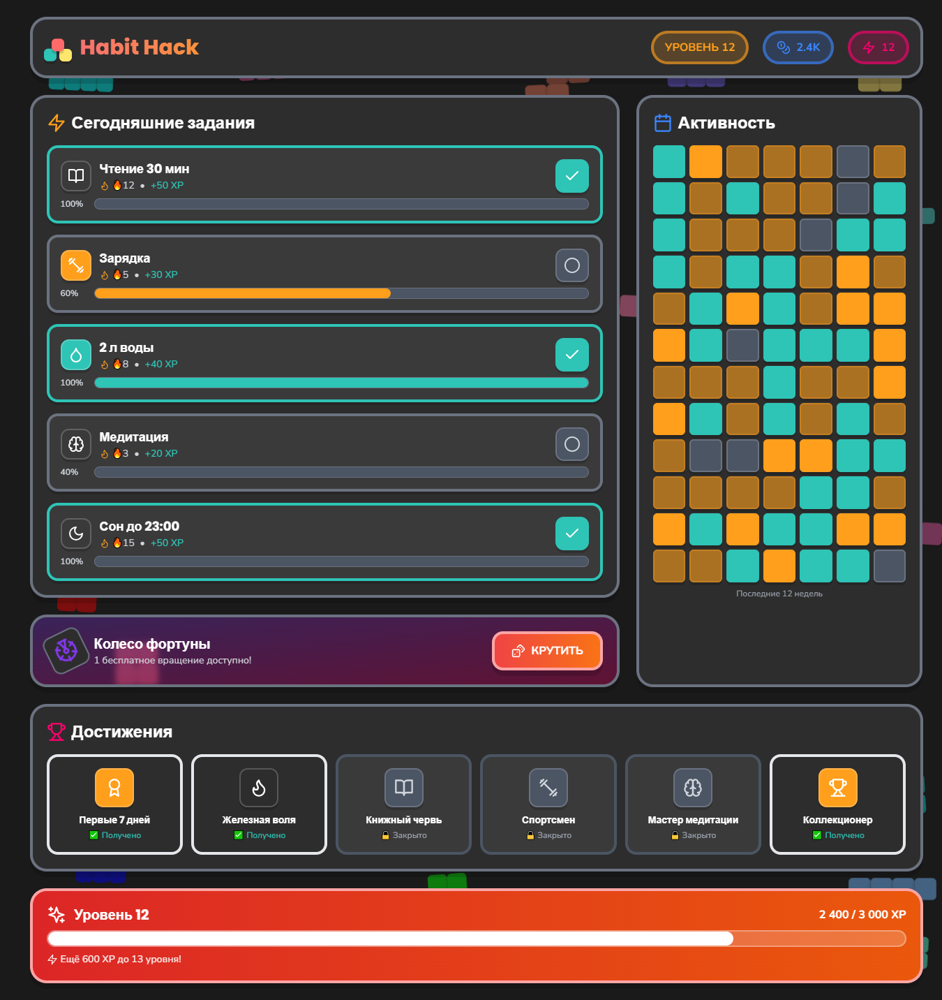
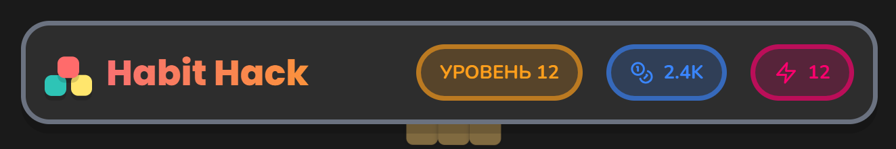
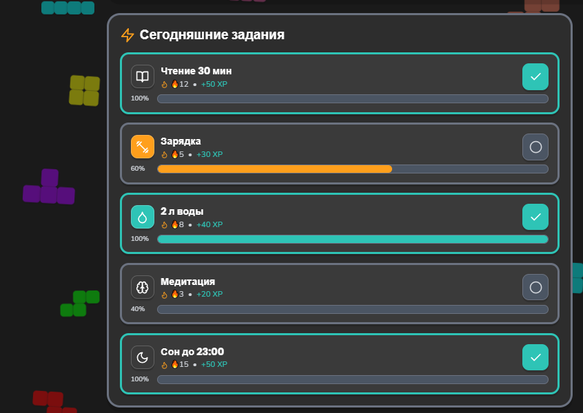
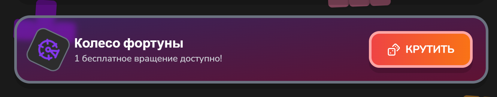
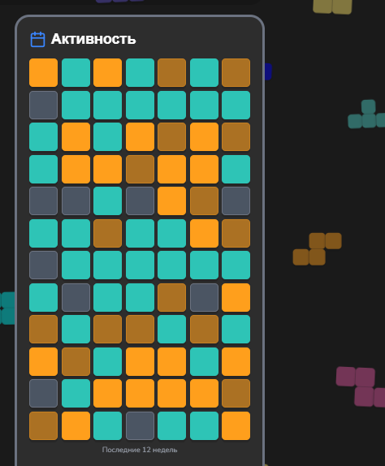
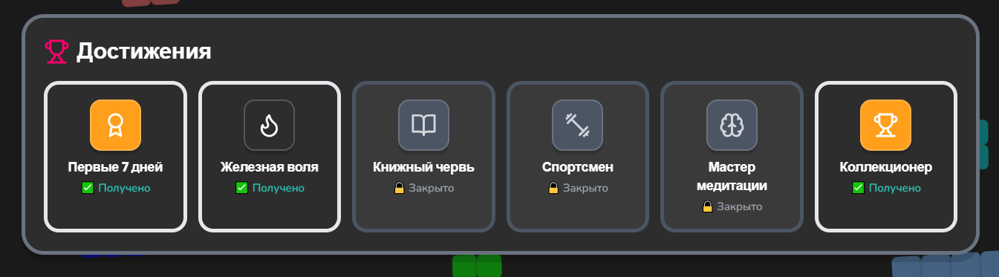
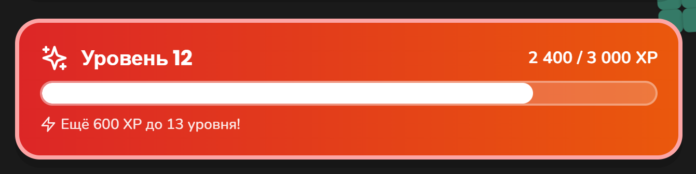

# 🎮 Habit Hack — Трекер привычек



## О проекте

**Habit Hack** — визуальный концепт трекера привычек в игровом стиле. Минималистичный интерфейс: серый фон, яркие акцентные цвета, объёмные кнопки с тенями. Проект создан для демонстрации навыков проектирования вовлекающих интерфейсов с элементами геймификации.

> Проект является UI-прототипом. Данные статичны, серверная логика отсутствует.

## 🛠 Стек

- ⚛️ React 18 + TypeScript
- 🎨 Tailwind CSS (игровая цветовая схема)
- 🎬 Framer Motion (анимации)
- 🎯 Lucide Icons
- ⚡ Vite

## 📸 Скриншоты

### 🏠 Главный дашборд
Полный обзор трекера: список привычек, тепловая карта активности, достижения и прогресс уровня.


---

### 🎯 Шапка и статистика
Верхняя панель с уровнем, игровой валютой и аватаром. Декоративные кубики по углам создают игровое настроение.



```
[🎯] Habit Hack      УРОВЕНЬ 12    💎 2.4K    🎮 12
```

- 🎯 — логотип-мишень (кликабельный, ведёт на главную)
- ⬆️ Уровень 12 — текущий прогресс игрока (растёт с каждым выполненным заданием)
- 💎 2.4K — накопленные монеты (можно тратить в магазине)
- 🎮 12 — аватар с текущим уровнем (меняется при достижении новых уровней)

---

### 📝 Список привычек
Карточки с заданиями на сегодня. Каждая показывает прогресс, streak (дней подряд) и награду в XP.



```
[📘] Чтение 30 мин    🔥12  +50 XP
     ████████████████████████ 100%    [✅]
```

- 📘 — иконка привычки (меняется в зависимости от типа)
- 🔥12 — сколько дней подряд выполняется (сбрасывается при пропуске)
- ➕50 XP — опыт за выполнение
- ████████ — прогресс-бар заполняется в течение дня
- [✅] — кнопка отметки выполнения (при нажатии утапливается и меняет цвет)

🟢 Зелёная рамка — привычка выполнена  
⚪ Серая рамка — ещё не выполнена  
🟡 Жёлтая рамка — частично выполнена

---

### 🎡 Колесо фортуны
Ежедневная механика для дополнительной мотивации. Одно бесплатное вращение в день.



```
[🎡] Колесо фортуны
     1 бесплатное вращение доступно!    [🎲 КРУТИТЬ]
```

- 🎡 — иконка колеса постоянно вращается, привлекая внимание
- 1️⃣ — счётчик бесплатных вращений (обновляется каждый день)
- 🎲 КРУТИТЬ — объёмная кнопка с тенью, при нажатии утапливается
- 🎁 Возможные призы: 💎 монеты, ⚡ опыт, 🔥 защита от пропуска дня, 🎨 новые темы

---

### 📊 Тепловая карта активности
Сетка 7×12 квадратов, где каждый квадрат — один день. Визуализация прогресса за последние 3 месяца.



Цвета в зависимости от количества выполненных привычек:
- ⬜ Серый — 0 привычек (день пропущен 😢)
- 🟨 Светло-оранжевый — 1–2 привычки (неплохо 🌱)
- 🟧 Оранжевый — 3–4 привычки (хорошо 📈)
- 🟩 Зелёный — 5+ привычек (отлично 🏆)
- 🟦 Синий — все привычки выполнены (идеально 💯)

При наведении на квадрат всплывает подсказка с датой и количеством.

---

### 🏆 Достижения
Шесть ачивок за разные успехи. Разблокированные подсвечены, закрытые отображаются серыми.



| Название | Иконка | Статус | Награда |
|----------|--------|--------|---------|
| Первые 7 дней | 🏆 | ✅ Получено | +100 💎 |
| Железная воля | 🔥 | ✅ Получено | +200 💎 |
| Книжный червь | 📘 | 🔒 Закрыто | +150 💎 |
| Спортсмен | 🏋️ | 🔒 Закрыто | +150 💎 |
| Мастер медитации | 🧠 | 🔒 Закрыто | +150 💎 |
| Коллекционер | 🏆 | ✅ Получено | +300 💎 |

При получении достижения появляется всплывающее уведомление с конфетти 🎉

---

### 📈 Прогресс уровня
Шкала опыта показывает, сколько осталось до следующего уровня.



```
Уровень 12              2,400 / 3,000 XP
████████████████████░░░░░░░░
✨ Ещё 600 XP до 13 уровня!
```

- ████ — заполненная часть шкалы (80%)
- ░░░░ — оставшаяся часть (20%)
- ✨ — иконка подсказки, сколько осталось
- При повышении уровня — анимация и +1 к счётчику на аватаре

---

## 🎨 Дизайн

### Цветовая палитра
| Цвет | HEX | Применение |
|------|-----|------------|
| 🟠 Оранжевый | `#FF9F1C` | Кнопки, акценты, XP |
| 🟢 Зелёный | `#2EC4B6` | Выполненные привычки |
| 🔵 Синий | `#3A86FF` | Монеты, графики |
| 🩷 Розовый | `#FF006E` | Аватар, колесо |
| 🟣 Фиолетовый | `#8338EC` | Достижения |

### Типографика
- **Nunito** — основной шрифт (округлый, дружелюбный)
- **Poppins** — заголовки (игровой, выразительный)

### Особенности дизайна
- 🎲 Объёмные тени `shadow-game` создают эффект «выдавленных» кубиков
- 🧩 Декоративные кубики по углам экрана плавно покачиваются
- ⬆️ При наведении карточки приподнимаются (`y: -5`)
- 👆 Кнопки утапливаются при нажатии (`scale: 0.95`)
- 🌊 Плавные анимации появления всех элементов

---

## 🔄 Как проходит день

```
🌅 Утром открываете приложение
   ↓
📋 Смотрите список привычек на сегодня
   ↓
✅ Выполняете задание — нажимаете галочку
   ↓
💎 Получаете опыт (+XP) и монеты (+💰)
   ↓
🔥 Streak увеличивается (дней подряд)
   ↓
🎡 Крутите колесо фортуны (раз в день бесплатно)
   ↓
📊 Смотрите тепловую карту — видите свой прогресс за месяц
   ↓
🏆 Получаете достижения за рекорды
   ↓
😴 Закрываете до завтра, чтобы не сломать streak
```

---

## 🚀 Запуск

```bash
git clone https://github.com/kosu1l1ya/habit-hack.git
cd habit-hack
npm install
npm run dev
```

Открыть `http://localhost:5173` 🌐

---

## 📁 Структура проекта

```
habit-hack/
├── screenshots/
│   ├── main.png
│   ├── header.png
│   ├── habits.png
│   ├── wheel.png
│   ├── heatmap.png
│   ├── achievements.png
│   └── progress.png
├── src/
│   ├── App.tsx
│   ├── index.css
│   └── main.tsx
├── index.html
├── tailwind.config.js
├── postcss.config.js
└── README.md
```

---

## 💡 Что демонстрирует проект

- 🎮 Проектирование геймифицированных интерфейсов
- 🎬 Работу с анимациями Framer Motion (появление, ховеры, бесконечное вращение)
- 🎨 Создание кастомной цветовой схемы в Tailwind
- 📊 Вёрстку сложных сеток (тепловая карта 7×12)
- 🔥 Понимание механик удержания пользователей (streak, уровни, достижения)
- 🧩 Компонентный подход в React

